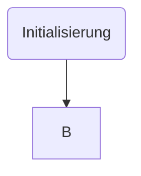

# TESTAT 2

## Vorgegeben

* Uhr zeigt Stunden und Minuten
* dezimalpunkt blinkt im Sekundentakt
* Taste 1 inkrementiert Stunden
* Taste 2 inkrementiert Minunten
* Taste 3 startet die uhr bzw. aktiviert wieder den Stellmodus

## Eigene Gedanken
* Stundenanzeige nicht größer 23
* Minutenanzeige nicht größer 59
* Stell- und Timermodus (wird über Taste 3 geswitcht)
* klingel über ISR

## Variablen
* stunden
* minuten
* modus

## Initialisierung
* Ausgang
  * PB0
  * PD7
  * PD4
* Eingang
  * PC1
  * PC2
  * PC3

